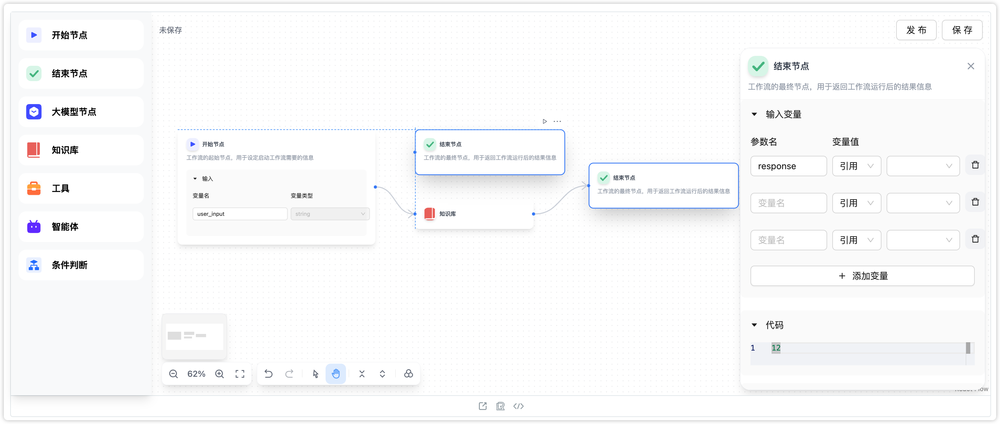

## Out-of-the-box Agent Workflow solutions

  
  

The core of the canvas is the paradigm of the canvas, which is manifested in nodes, connectivity, and data flow management
This solution expects to cover both paradigms: process orchestration and configuration assembly. And comprehensive canvas capabilities are built-in.

- AI featured custom nodes, including input and output of its own configuration items, support for running results view
- Canvas supports data flow, variable referencing and streaming
- Unified Schema, users only need to care about the data layer access, define the data structure in line with the Schema
- Support code customization nodes
- Built-in canvas basic capabilities , undo redo , auto-save , layout optimization and so on.
- Nested workflow logic
- Built-in AI featured front-end components
- Support for light and dark color themes
