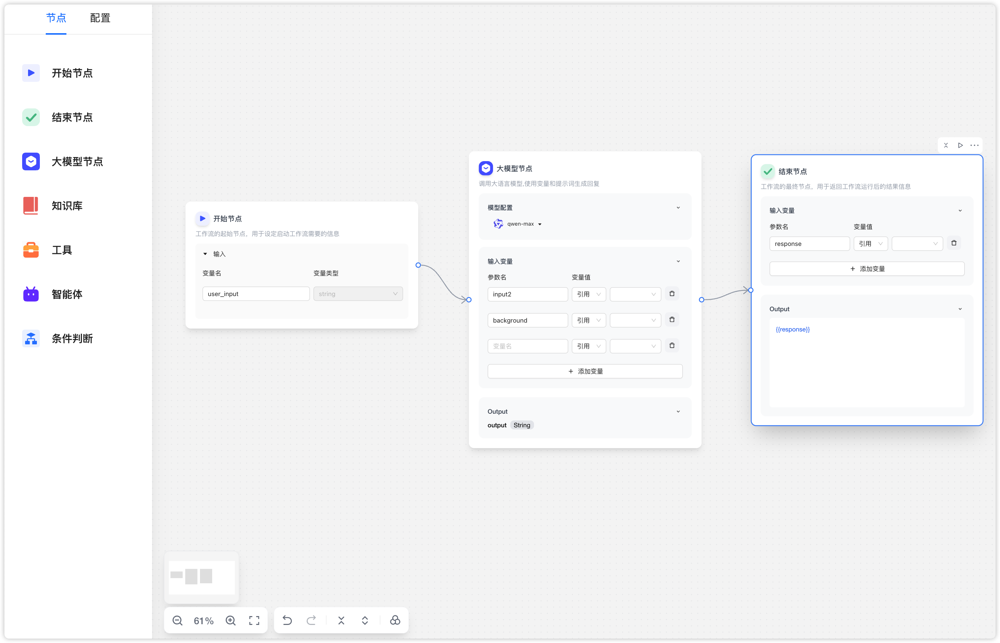

## 开箱即用的 Agent Workflow 方案 🎉

  
  

画布的核心是画布的范式，具体表现在节点、连线、数据流管理
本方案期望能覆盖两种范式：流程编排和配置组装。并且内置全面的画布能力。

- AI 特色的自定义节点，包含输入输出自身配置项，支持运行结果查看
- 画布支持数据流，支持变量的引用和流转
- 统一的 Schema，使用者只需要关心数据层接入，定义符合 Schema 的数据结构
- 支持代码自定义节点
- 内置画布基础能力，撤销重做、自动保存、布局优化等
- workflow 嵌套逻辑
- 内置 AI 特色前端组件
- 支持明、暗色主题

部分还处于开发中 🚧
